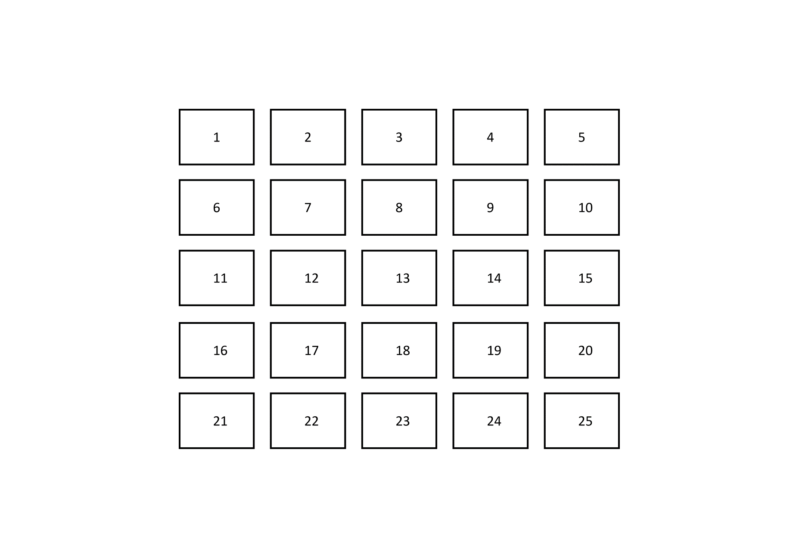
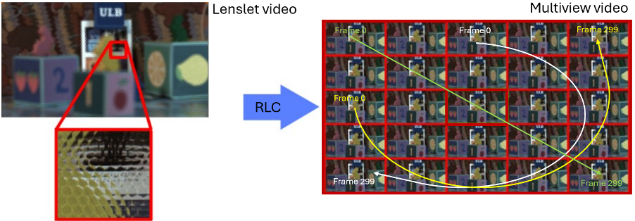

# pose-trace-generation

The python script is used to generate the pose traces for subjective evaluation of lenslet video sequence. The pose trace is a video sweeping over different views during the sequence.
The video format is either mp4 or yuv 4:2:0 8 bits packed.

For each frames of the lenslet video sequence, 5x5 multiviews must be synthesized using the Reference Lenslet content Convertor ([RLC](https://gitlab.com/mpeg-dense-light-field/rlc)) before using the script.
Please be advised that the script assumes the multi lens array is in a horizontal arrangement and the multiview synthezied are in the order shown below. If it is not the case, the user should use option -p to directly give the list of views which will be used for the pose trace.



There are six different viewing paths defined for the pose trace. The first three correspond to the examples given below. By default, the video start at frame 0 and stop at frame 299, it is possible choose other start and stop frames. An equal number of frames is used for each viewpoint.


_Figure taken from the Common Test Conditions for Lenslet Video Coding, ISO/IEC JTC 1/SC 29/WG 04 N0457_
 
 ## Requirement
 Please be advised, the script use ffmpeg. Users should have ffmpeg installed on their computer before running the script.
 
 ## How to run

 The script should be run with two mandatory parameters and five optional ones.
  - 'input path' : the generic path for a multiview image for one frame of the sequence.
  - 'output' : name of the video to be produce, extension should be either yuv or mp4. 
  - '-p' : Either, one integer in [0,5], define which sweeping path of the figure above is used. 0 for the green path, 1 for the yellow path, 2 for the white path, 3 for diagonal back and forth, 4 for boundary path which goes through views (1,2,3,9,15,20,25), and 5 for horizontal serpentine. Default value is 0. Or, if several integers are provided in [0,25], they are treated as the list of views used for the pose trace.
  - '-s' : integer to indicate the starting frame. Default value is 0.
  - '-e' : integer to indicate the ending frame. Default value is 299.
  - '-pad' : define what should be the size of the video produced, format should be widthxheight. Multiview image will be padded with gray pixels (RGB : 128,128,128) to fit with the format desired.
  - '-crop' : define what should be the size of the video produced, format should be widthxheight. Multiview image will be cropped symmetrically to fit with the format desired.

The pad and crop option can not be used both at the same time. Users should select the appropriated option for their use case.
If the multiview images for the different frames are stored in a folder called data with the following architecture :
```
-data
    -Res_001
        -image_001.png
        -image_002.png
        -...
        -image_025.png
    -Res_002
        -image_001.png
        -image_002.png
        -...
        -image_025.png
    -Res_003
    -...
    -Res_300
```
The command to generate a pose trace which start on the first frame (Res_001), end on the last frame (Res_300) and use the diagonal path is :

```python pose-trace-generation.py "data/Res_%03d/image_%03d.png" output.mp4 -s 1 -e 300```

The script will generate a video 'output.mp4' in the folder 'data'. While running, the script create a temporary directory to store the views used to generate the video, this directory is removed at the end.

To generate a yuv 4:2:0 video, which use the horizontal serpentine pose trace and is padded to size 1920x1080, use the following command :

```python pose-trace-generation.py "data/Res_%03d/image_%03d.png" output.yuv -s 1 -e 300 -p 5 -pad 1920x1080```

